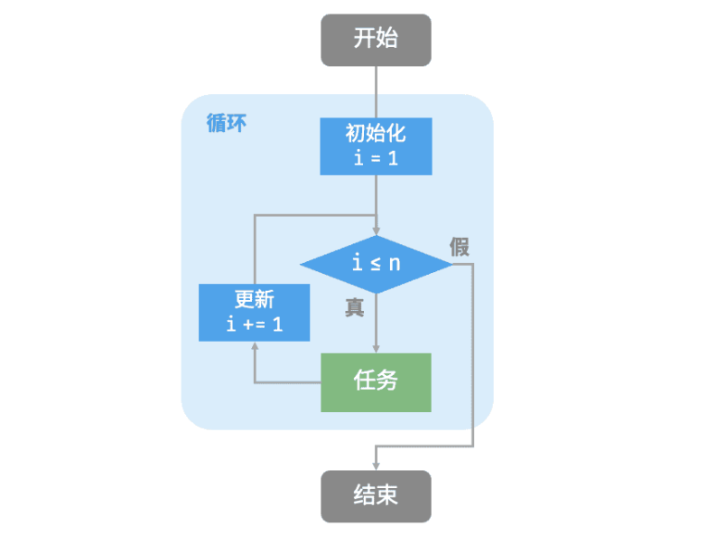
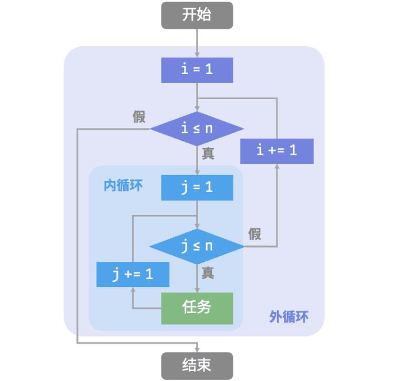

# Hello Algorithm

记录我在 [Hello 算法](https://www.hello-algo.com/) 上面学习的笔记，作为快速回顾和复习的功能。同时也会做相应的题目，

## 1. 初识算法与数据结构

算法并不都涉及复杂数学，更多依赖的是基础逻辑。比如：

- 查字典，就是经典的**二分查找**算法
- 整理扑克牌，本质上是**插入排序**算法
- 货币找零，就是著名的**贪心**算法

### 算法是什么

1. **算法定义**

    **算法（algorithm）** 是在有限时间内解决特定问题的一组指令或操作步骤，它具有以下特性。

    - 问题是明确的，包含清晰的输入和输出定义。
    - 具有可行性，能够在有限步骤、时间和内存空间下完成。
    - 各步骤都有确定的含义，在相同的输入和运行条件下，输出始终相同。

2. **数据结构定义**

    **数据结构（data structure）** 是组织和存储数据的方式，涵盖数据内容、数据之间关系和数据操作方法，它具有以下设计目标。

    - 空间占用尽量少，以节省计算机内存。
    - 数据操作尽可能快速，涵盖数据访问、添加、删除、更新等。
    - 提供简洁的数据表示和逻辑信息，以便算法高效运行。

    **数据结构设计是一个充满权衡的过程。** 如果想在某方面取得提升，往往需要在另一方面作出妥协。下面举两个例子。

    - 链表相较于数组，在数据添加和删除操作上更加便捷，但牺牲了数据访问速度。
    - 图相较于链表，提供了更丰富的逻辑信息，但需要占用更大的内存空间。

3. **数据结构与算法的关系**

    - 数据结构是算法的基石。数据结构为算法提供了结构化存储的数据，以及操作数据的方法。
    - 算法为数据结构注入生命力。数据结构本身仅存储数据信息，结合算法才能解决特定问题。
    - 算法通常可以基于不同的数据结构实现，但执行效率可能相差很大，选择合适的数据结构是关键。

## 2. 复杂度分析

### 2.1 算法效率评估

在算法设计中，我们先后追求两个层面的目标，首先就是要**找到问题解法**，之后是**寻求最优解法**。那意思就是，我们设计的算法不仅要在规定的输入范围内可靠地正确地求得解，而且还要在时间复杂度和空间复杂度上尽可能优秀。这里其实就引出了衡量算法优劣的主要评价指标——算法效率，以及其两个维度：

- **时间效率：** 算法运行时间的长短。
- **空间效率：** 算法占用内存空间的大小。

简而言之，**我们的目标是设计“既快又省”的数据结构与算法。**

在实际测试中，有很大的局限性，一方面**难以排除测试环境的干扰因素**，另一方面，展**开完整测试非常耗费资源。** 所以我们可以考虑仅通过一些计算来评估算法的效率。这种估算方法被称为**渐近复杂度分析（asymptotic complexity analysis）**，简称**复杂度分析**。

复杂度分析能够体现算法运行所需的时间和空间资源与输入数据规模之间的关系。**它描述了随着输入数据规模的增加，算法执行所需时间和空间的增长趋势。**

### 2.2 迭代与递归

在算法中，重复执行某个任务是很常见的，它与复杂度分析息息相关。因此，在介绍时间复杂度和空间复杂度之前，我们先来了解如何在程序中实现重复执行任务，即两种基本的程序控制结构：迭代、递归。

#### 2.2.1 迭代

**迭代（iteration）** 是一种重复执行某个任务的控制结构。在迭代中，程序会在满足一定的条件下重复执行某段代码，直到这个条件不再满足。

1. **for 循环**

    `for` 循环是最常见的迭代形式之一，适合在**预先知道迭代次数**时使用。

    以下函数基于`for`循环实现了求和$1+2+···+n$，求和结果使用变量`res`记录。

    
    <!-- tab C++ -->
    ```cpp
    /* for 循环 */
    int forLoop(int n) {
        int res = 0;
        // 循环求和 1, 2, ..., n-1, n
        for (int i = 1; i <= n; ++i) {
            res += i;
        }
        return res;
    }
    ```
    <!-- endtab -->

    <!-- tab Java -->
    ```java
    /* for 循环 */
    int forLoop(int n) {
        int res = 0;
        // 循环求和 1, 2, ..., n-1, n
        for (int i = 1; i <= n; i++) {
            res += i;
        }
        return res;
    }
    ```
    <!-- endtab -->
    

    <div align="center">
    
    <br>
    <small>图 2-1 求和函数的流程框图</small>
    </div>

    此求和函数的操作数量与输入数据大小$n$成正比，或者说成“线性关系”。实际上，时**间复杂度描述的就是这个“线性关系”**。

2. **while 循环**

    与`for`循环类似，`while`循环也是一种实现迭代的方法。在`while`循环中，程序每轮都会先检查条件，如果条件为真，则继续执行，否则就结束循环。

    
    <!-- tab C++ -->
    ```cpp
    /* while 循环 */
    int whileLoop(int n) {
        int res = 0;
        int i = 1; // 初始化条件变量
        // 循环求和 1, 2, ..., n-1, n
        while (i <= n) {
            res += i;
            i++; // 更新条件变量
        }
        return res;
    }
    ```
    <!-- endtab -->

    <!-- tab Java -->
    ```java
    /* while 循环 */
    int whileLoop(int n) {
        int res = 0;
        int i = 1; // 初始化条件变量
        // 循环求和 1, 2, ..., n-1, n
        while (i <= n) {
            res += i;
            i++; // 更新条件变量
        }
        return res;
    }
    ```
    <!-- endtab -->
    

    总的来说，`for`**循环的代码更加紧凑**，`while`**循环更加灵活**，两者都可以实现迭代结构。选择使用哪一个应该根据特定问题的需求来决定。

3. **嵌套循环**
    以`for`循环为例：

    
    <!-- tab C++ -->
    ```cpp
    /* 双层 for 循环 */
    string nestedForLoop(int n) {
        ostringstream res;
        // 循环 i = 1, 2, ..., n-1, n
        for (int i = 1; i <= n; ++i) {
            // 循环 j = 1, 2, ..., n-1, n
            for (int j = 1; j <= n; ++j) {
                res << "(" << i << ", " << j << "), ";
            }
        }
        return res.str();
    }
    ```
    <!-- endtab -->

    <!-- tab Java -->
    ```java
    /* 双层 for 循环 */
    String nestedForLoop(int n) {
        StringBuilder res = new StringBuilder();
        // 循环 i = 1, 2, ..., n-1, n
        for (int i = 1; i <= n; i++) {
            // 循环 j = 1, 2, ..., n-1, n
            for (int j = 1; j <= n; j++) {
                res.append("(" + i + ", " + j + "), ");
            }
        }
        return res.toString();
    }
    ```
    <!-- endtab -->
    

    <div align="center">
    
    <br>
    <small>图 2-2 嵌套循环的流程框图</small>
    </div>

#### 2.2.2 递归

**递归（recursion）** 是一种算法策略，通过函数调用自身来解决问题。它主要包含两个阶段。

1. **递**：程序不断深入地调用自身，通常传入更小或更简化的参数，直到达到“终止条件”。
2. **归**：触发“终止条件”后，程序从最深层的递归函数开始逐层返回，汇聚每一层的结果。

而从实现的角度看，递归代码主要包含三个要素。

1. **终止条件**：用于决定什么时候由“递”转“归”。
2. **递归调用**：对应“递”，函数调用自身，通常输入更小或更简化的参数。
3. **返回结果**：对应“归”，将当前递归层级的结果返回至上一层。


<!-- tab C++ -->
```cpp
/* 递归 */
int recur(int n) {
    // 终止条件
    if (n == 1)
        return 1;
    // 递：递归调用
    int res = recur(n - 1);
    // 归：返回结果
    return n + res;
}
```
<!-- endtab -->

<!-- tab Java -->
```java
/* 递归 */
int recur(int n) {
    // 终止条件
    if (n == 1)
        return 1;
    // 递：递归调用
    int res = recur(n - 1);
    // 归：返回结果
    return n + res;
}
```
<!-- endtab -->


<div align="center">

<br>
<small>图 2-3 求和函数的流程框图</small>
</div>

虽然从计算角度看，迭代与递归可以得到相同的结果，但**它们代表了两种完全不同的思考和解决问题的范式。**

- **迭代：** “自下而上”地解决问题。从最基础的步骤开始，然后不断重复或累加这些步骤，直到任务完成。
- **递归：** “自上而下”地解决问题。将原问题分解为更小的子问题，这些子问题和原问题具有相同的形式。接下来将子问题继续分解为更小的子问题，直到基本情况时停止（基本情况的解是已知的）。

> 之后有关递归和栈的部分，这里就不再做记录了，直接看[原文](https://www.hello-algo.com/chapter_computational_complexity/iteration_and_recursion/#1)效果会更好一些把

### 2.3 时间复杂度

### 2.4 空间复杂度


---

## 题

题目来源：[LeetCode-Book](https://github.com/krahets/LeetCode-Book)