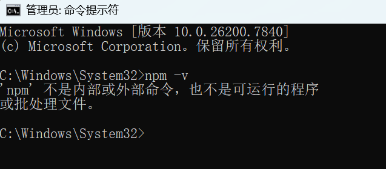

# Hexo_Blog

## 这是一个基于Hexo的博客项目

都说万事开头难，这第一步就把我难住了。明明已经安装了node.js，`npm install hexo-cli -g`也安装的好好的，可就在运行`hexo -v`检验时说没有安装，真是气得我够呛。

环境变量没搞对？我去重新安装了一下，又重新配置，解决算是……解决了吧，在管理员权限下的命令提示符（默认目录）里面运行的好好的，输入`hexo -v`，就显示了版本号。可我不在`C:|System32`目录下做项目啊，后来改了改，结果又找不到npm了！




不过我还是反思了一下，也许自己没走对过程中的某一步，才导致出现问题。所以最终石师傅决定彻底重装。教程参考[知乎][1]的这个教程，记得重启。

到跟着这个教程做完，已经过去一个小时了。

**环境配置还有一步**，在系统变量里面新建了`NODE_PATH`之后，在系统变量的`Path`里面添加`%NODE_PATH%`，然后记得重启电脑。

现在在项目路径下的终端已经可以运行`npm -v`了,太棒啦终于TMD弄好了😭😭😭

```bash
# 安装Hexo
npm install -g hexo-cli

# 检验安装是否成功
hexo -v
# 出现版本号等就成功了
```

### 接下来才算可以正式开始了

```bash
hexo init
# 看到 Start blogging with Hexo! 就是初始化成功

# 安装依赖
npm install
```

### 本地预览博客

```bash
hexo g
hexo s
```

应该能看到默认的一个博客页面，这样基本就OK了。不过我想自己找个模板不用默认的，所以需要再克隆一下仓库

```bash
git clone https://github.com/V-Vincen/hexo-theme-livemylife.git themes/livemylife
```

速度感人，不过好在是在正轨上走。终于安装完成之后，继续下述操作

```bash
# 安装主题依赖
npm install hexo-renderer-pug hexo-renderer-stylus --save
```

### 修改配置文件启用主题

打开根目录下的`_config.yml`文件，找到`theme`这一行，将其修改为`theme: livemylife`。

可以预览一下，还是这两行代码

```bash
hexo g
hexo s
```

好吧果不其然又出错了，这个主题我感觉好看但是比较复杂，需要配置的多，还是老老实实用Butterfly吧

```bash
# 克隆Butterfly主题
git clone https://github.com/jerryc127/hexo-theme-butterfly.git themes/butterfly

# 安装Butterfly主题依赖
npm install hexo-renderer-pug hexo-renderer-stylus --save
```

把`theme: livemylife`改为`theme: butterfly`, 然后预览一下，应该能看到Butterfly主题了。

确实能看到了，可是这也太老了吧

### 简单配置主题

1. 修改站点信息

    打开根目录的 _config.yml，修改以下内容
    ```yaml
    # Site
    title: Absurd's Blog      # 主标题
    subtitle: '荒谬的博客'     # 副标题 
    description: '我的个人博客，记录一些个人的思考和学习经历'             # 描述
    keywords: Hexo,Blog,笔记,前端       # 关键字
    author: AbsurdZZ
    language: zh-CN
    timezone: 'Asia/Shanghai'
    ```

2. 配置主题

    进入 `themes/butterfly` 文件夹，复制 `_config.yml` 到根目录，重命名为 `_config.butterfly.yml`（这是主题配置文件，以后改主题都在这里）
    打开 `_config.butterfly.yml`，修改一下内容
    - `nav:`：导航栏菜单
    - `avatar:`：头像（把头像图片放在 source/images 文件夹，引用路径）
    - `social:`：社交链接（GitHub、邮箱等）

### 写下第一篇文章

```bash
hexo new "开山篇(一)"
```

运行命令后，能在 `./source/_posts` 文件下看到一个 `开山篇(一).md` 文件，之后就可以填写文章内容了。

```bash
# 本地预览文章
hexo g
hexo s
```

### 推送文章到GitHub Pages

首先创建 GitHub 仓库

登录 [GitHub][2]，点击右上角 `+` → `New repository`，之后取个仓库名，选择 `Public`，点击 `Create repository`。

`Git`之前我就配置过，所以直接做吧

```bash
# 1. 初始化 Git
git init

# 2. 添加所有文件
git add .

# 3. 提交（引号里是提交说明，随便写）
git commit -m "初始化Hexo博客"

# 4. 关联 GitHub 仓库（替换下面的地址）
# 地址在 GitHub 仓库页面，点击「Code」，复制 HTTPS 链接
git remote add origin https://github.com/Absurd-S/my_hexo_blog.git

# 5. 推送到 GitHub（第一次用 -u，以后直接 git push）
git branch -M main
git push -u origin main
```

这次推送注定会慢，因为是第一次推送，内容很多，以后一般就是推送文章了，会很快。

### Vercel 部署上线

首先用GitHub账号注册一个Vercel账号，登录上去。

登录后点击 `Add New...` → `Project` ，在 `Import Git Repository` 下面，找到之前创建的的 `Hexo`仓库，点击 `Import`

{width="33%"}

```text
Project Name：（这是将来分配的域名的的前缀，我输入absurdzz，那么Vercel给我分配的域名就是 absurdzz.vercel.app ）
Framework Preset：Vercel 会自动识别为 Hexo，不用改
Root Directory：保持默认
```

直接点击 `Deploy`,等待部署完成。Vercel 会自动构建博客，等待 1-2 分钟，看到「Congratulations!」就说明部署成功！

之后就可以访问域名来看到博客了。

### 更换域名

先确认2个**必须满足的前置条件**，不然绑定了也无法正常访问：
1.  你的Vercel项目已经有**成功的生产部署**（Deployments页面有绿色`Ready`的记录，不是Error状态）
2.  你购买的域名已经完成**实名认证**（国内域名商强制要求，未实名认证的域名会被暂停解析，无法生效）


 一、第一步：在Vercel中添加你的自定义域名
1.  登录Vercel，进入你的Hexo博客项目
2.  点击顶部「Settings」→ 左侧导航栏找到「Domains」（域名设置页）
3.  在页面的输入框中，输入你购买的完整域名（比如`absurdzz.com`，**不要加https://、www等前缀**），点击「Add」
4.  添加完成后，Vercel会自动跳转到解析配置页，给你提供对应的解析记录，**把这页的内容先留着，下一步要用**。


二、第二步：去域名购买平台，添加DNS解析记录
这一步的核心是：告诉域名商「你的这个域名，要指向Vercel的博客服务」，操作逻辑所有域名商（阿里云、腾讯云、华为云等）都通用，我以最常见的场景举例。

先明确2种常用域名场景，按需选择

| 域名类型 | 示例 | 优势 | 推荐度 |
| :--- | :--- | :--- | :--- |
| www子域名 | `www.absurdzz.com` | 配置最稳定，无兼容性问题，新手首选 | ⭐⭐⭐⭐⭐ |
| 根域名 | `absurdzz.com` | 输入更简洁，直接输域名就能访问 | ⭐⭐⭐ |


场景1：绑定www子域名（新手首选，零兼容问题）

1. 进入域名解析页面

登录你买域名的平台控制台，找到你的域名，点击「域名解析」/「DNS解析」→ 点击「添加记录」。

2. 按下面的参数填写解析记录

| 配置项 | 填写内容 | 说明 |
| :--- | :--- | :--- |
| 记录类型 | `CNAME` | 固定选这个，不要改 |
| 主机记录 | `www` | 代表你要绑定的是`www.xxx.com` |
| 记录值 | `cname.vercel-dns.com.` | Vercel官方固定值，结尾的点按域名商要求填写，大部分可省略 |
| TTL | 600（默认值） | 不用改，代表解析生效时间 |

填完点击「确认」/「保存」，这条记录就添加完成了。


场景2：绑定根域名（比如`absurdzz.com`）

1. 同样进入域名解析页面，添加记录
   
| 配置项 | 填写内容 | 说明 |
| :--- | :--- | :--- |
| 记录类型 | `A记录` | 国内大部分域名商根域名优先用A记录，兼容性最好 |
| 主机记录 | `@` | 固定填`@`，代表根域名本身 |
| 记录值 | `76.76.21.21` | Vercel官方固定的A记录IP，全球通用 |
| TTL | 600（默认值） | 不用改 |

填完点击保存即可。

---

进阶：根域名+www域名同时可用

如果你想两个地址都能访问到博客，**把上面两条记录都加上**，然后在Vercel的Domains页面，设置一个「主域名」，把另一个域名重定向到主域名，避免重复内容影响访问：
1.  在Vercel的Domains列表里，找到你想设为主域名的那条，点击右侧三个点 → 「Set as Primary Domain」
2.  再找到另一条域名，点击右侧三个点 → 「Edit」→ 「Redirect」，选择重定向到主域名，保存即可。


三、第三步：验证解析生效，完成绑定

1.  解析记录添加后，**一般10分钟内生效**，最慢不超过24小时（国内域名商通常几分钟就生效）
2.  回到Vercel的Domains页面，当你的域名旁边出现**绿色的对勾 ✅ Valid**，就说明解析成功，绑定完成了！
3.  Vercel会**自动为你的域名签发免费的HTTPS SSL证书**，全程不用你手动操作，生效后就能用`https://你的域名`安全访问。


四、新手必看避坑指南

1.  **备案问题**：你的博客部署在Vercel（境外服务器），**域名不需要备案**，就能直接访问；只有当你后续要迁到国内服务器/国内CDN时，才需要完成ICP备案。
2.  **解析不生效排查**：
    - 检查记录类型、主机记录、记录值有没有填错（最常见的是`@`和`www`搞混、CNAME和A记录填反）
    - 刷新本地DNS缓存：Windows管理员打开cmd，输入`ipconfig /flushdns`执行后，再重新访问
    - 用在线工具验证：打开https://tool.chinaz.com/dns，输入你的域名，看能不能解析到你填的IP/CNAME
3.  **国内访问速度优化**：Vercel原生节点国内访问速度一般，如果你想提升加载速度，可以把域名的DNS改成Cloudflare，用免费的CDN加速，国内访问速度会有明显提升。
4.  **HTTPS异常**：如果提示证书不安全，不用慌，Vercel签发证书需要10-30分钟，等待生效即可，全程不用手动操作。

五、后续更新文章的流程不变

绑定域名后，你更新文章的流程完全不用改：
本地写好文章 → `git push`推送到GitHub → Vercel自动构建部署 → 你的自定义域名会自动同步更新内容，不用做任何额外配置。

## 后记

当然，虽然这篇文章是我不断试错总结出来的，但实际过程中我还是发生了很多问题，很折腾。包括但不限于以下：

- Github死活连接不上，push不上去
- Vercel部署失败，提示没有找到Hexo项目
- 主题文件夹里面的Git没删干净
- Vercel部署时候说是没有权限
- 部署完成之后访问不了，依旧404（后来发现是部署的测试版本，得手动把成功的测试发布到Project版本）
- 访问慢打不开
- 等等吧

至于上述问题，我把截图发给豆包，一般都能解决。访问慢的事我注册了一个新域名，就是现在这个，访问速度很快。虽然没有互联网上其他博客美观和惊艳吧，但总的来说，还是感谢 **GitHub** 、**Hexo** 和 **Vercel** 提供的便利技术和服务，让我可以搭建一个自己的博客，并且能随时更新。


- - - - -
[1]: https://zhuanlan.zhihu.com/p/2004975759790477711
[2]: https://github.com/