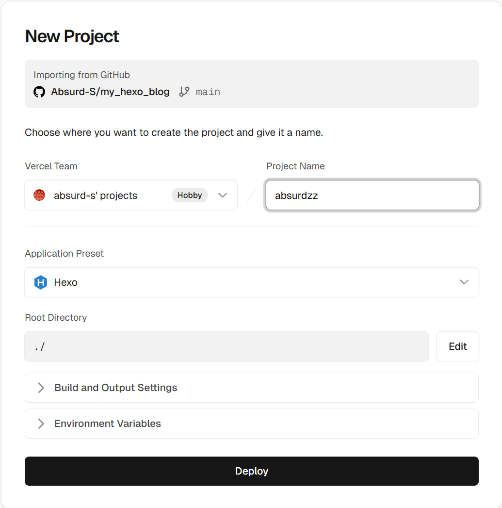

# Hexo_Blog

## 这是一个基于Hexo的博客项目

都说万事开头难，这第一步就把我难住了。明明已经安装了node.js，`npm install hexo-cli -g`也安装的好好的，可就在运行`hexo -v`检验时说没有安装，真是气得我够呛。

环境变量没搞对？我去重新安装了一下，又重新配置，解决算是……解决了吧，在管理员权限下的命令提示符（默认目录）里面运行的好好的，输入`hexo -v`，就显示了版本号。可我不在`C:|System32`目录下做项目啊，后来改了改，结果又找不到npm了！


不过我还是反思了一下，也许自己没走对过程中的某一步，才导致出现问题。所以最终石师傅决定彻底重装。教程参考[知乎][1]的这个教程，记得重启。

到跟着这个教程做完，已经过去一个小时了。

**环境配置还有一步**，在系统变量里面新建了`NODE_PATH`之后，在系统变量的`Path`里面添加`%NODE_PATH%`，然后记得重启电脑。

现在在项目路径下的终端已经可以运行`npm -v`了,太棒啦终于TMD弄好了😭😭😭

```bash
# 安装Hexo
npm install -g hexo-cli

# 检验安装是否成功
hexo -v
# 出现版本号等就成功了
```

### 接下来才算可以正式开始了

```bash
hexo init
# 看到 Start blogging with Hexo! 就是初始化成功

# 安装依赖
npm install
```

### 本地预览博客

```bash
hexo g
hexo s
```

应该能看到默认的一个博客页面，这样基本就OK了。不过我想自己找个模板不用默认的，所以需要再克隆一下仓库

```bash
git clone https://github.com/V-Vincen/hexo-theme-livemylife.git themes/livemylife
```

速度感人，不过好在是在正轨上走。终于安装完成之后，继续下述操作

```bash
# 安装主题依赖
npm install hexo-renderer-pug hexo-renderer-stylus --save
```

### 修改配置文件启用主题

打开根目录下的`_config.yml`文件，找到`theme`这一行，将其修改为`theme: livemylife`。

可以预览一下，还是这两行代码

```bash
hexo g
hexo s
```

好吧果不其然又出错了，这个主题我感觉好看但是比较复杂，需要配置的多，还是老老实实用Butterfly吧

```bash
# 克隆Butterfly主题
git clone https://github.com/jerryc127/hexo-theme-butterfly.git themes/butterfly

# 安装Butterfly主题依赖
npm install hexo-renderer-pug hexo-renderer-stylus --save
```

把`theme: livemylife`改为`theme: butterfly`, 然后预览一下，应该能看到Butterfly主题了。

确实能看到了，可是这也太老了吧

### 简单配置主题

1. 修改站点信息

    打开根目录的 _config.yml，修改以下内容
    ```yaml
    # Site
    title: Absurd's Blog      # 主标题
    subtitle: '荒谬的博客'     # 副标题 
    description: '我的个人博客，记录一些个人的思考和学习经历'             # 描述
    keywords: Hexo,Blog,笔记,前端       # 关键字
    author: AbsurdZZ
    language: zh-CN
    timezone: 'Asia/Shanghai'
    ```

2. 配置主题

    进入 `themes/butterfly` 文件夹，复制 `_config.yml` 到根目录，重命名为 `_config.butterfly.yml`（这是主题配置文件，以后改主题都在这里）
    打开 `_config.butterfly.yml`，修改一下内容
    - `nav:`：导航栏菜单
    - `avatar:`：头像（把头像图片放在 source/images 文件夹，引用路径）
    - `social:`：社交链接（GitHub、邮箱等）

### 写下第一篇文章

```bash
hexo new "开山篇(一)"
```

运行命令后，能在 `./source/_posts` 文件下看到一个 `开山篇(一).md` 文件，之后就可以填写文章内容了。

```bash
# 本地预览文章
hexo g
hexo s
```

### 推送文章到GitHub Pages

首先创建 GitHub 仓库

登录 [GitHub][2]，点击右上角 `+` → `New repository`，之后取个仓库名，选择 `Public`，点击 `Create repository`。

`Git`之前我就配置过，所以直接做吧

```bash
# 1. 初始化 Git
git init

# 2. 添加所有文件
git add .

# 3. 提交（引号里是提交说明，随便写）
git commit -m "初始化Hexo博客"

# 4. 关联 GitHub 仓库（替换下面的地址）
# 地址在 GitHub 仓库页面，点击「Code」，复制 HTTPS 链接
git remote add origin https://github.com/Absurd-S/my_hexo_blog.git

# 5. 推送到 GitHub（第一次用 -u，以后直接 git push）
git branch -M main
git push -u origin main
```

这次推送注定会慢，因为是第一次推送，内容很多，以后一般就是推送文章了，会很快。




- - - - -
[1]: https://zhuanlan.zhihu.com/p/2004975759790477711
[2]: https://github.com/